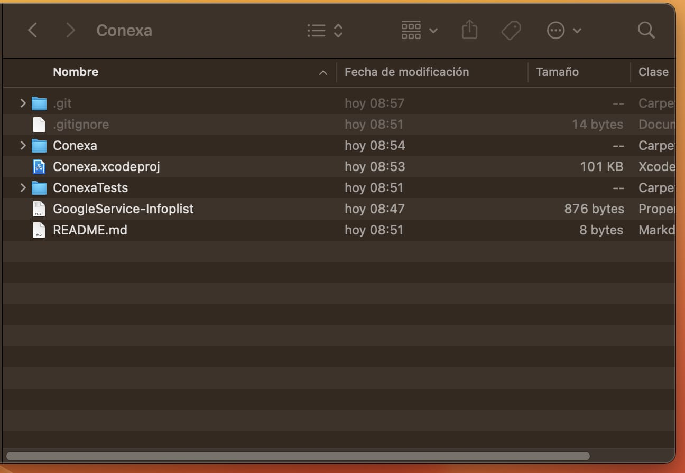
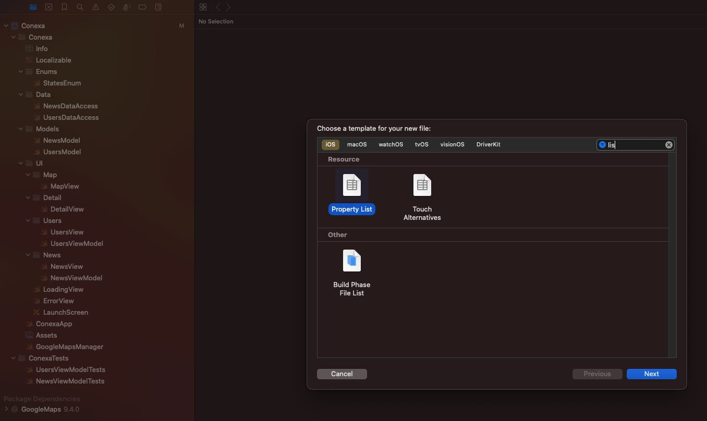
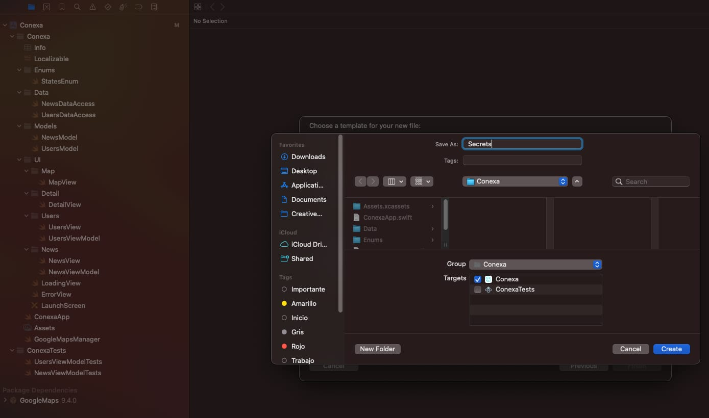
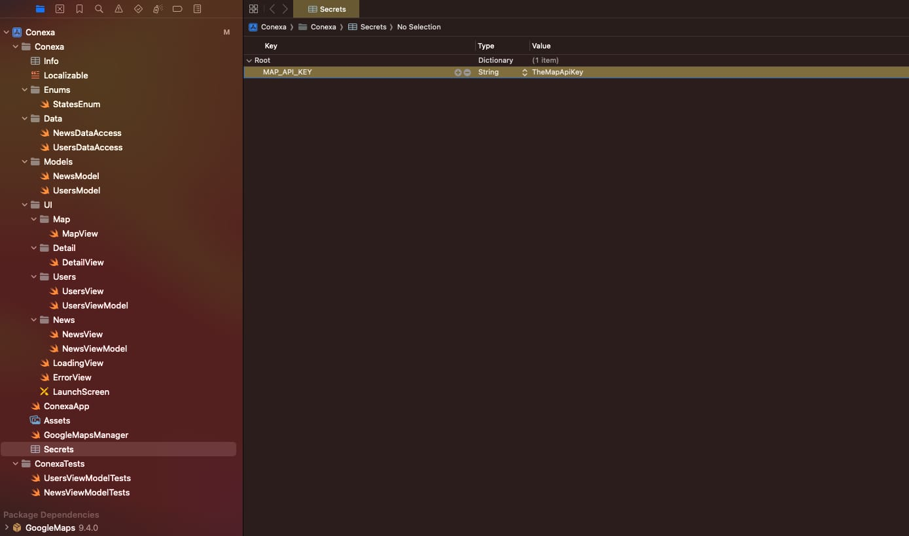

#Conexa

# 🧭 Configuración Inicial del Proyecto Xcode

Este documento explica cómo configurar los archivos necesarios para que tu proyecto funcione correctamente con claves secretas y servicios como Google Maps.

---

## 1️⃣ Agrega el archivo `GoogleService-Info.plist`

Coloca el archivo `GoogleService-Info.plist` en la **carpeta raíz** de tu proyecto.

---

## 2️⃣ Crea el archivo `Secrets.plist`

En la **carpeta principal del proyecto**, crea un archivo de tipo **Property List** llamado `Secrets.plist`.

---

## 3️⃣ Asegúrate de incluir el Target correcto

Verifica que el archivo `Secrets.plist` esté marcado para el target correspondiente dentro del proyecto.

---

## 4️⃣ Agrega tu clave `MAP_API_KEY`

Dentro de `Secrets.plist`, agrega la clave `MAP_API_KEY` con el valor correspondiente a tu API Key.

---

✅ ¡Listo! Ya podes darle a "Build" y ejecutar la aplicación
